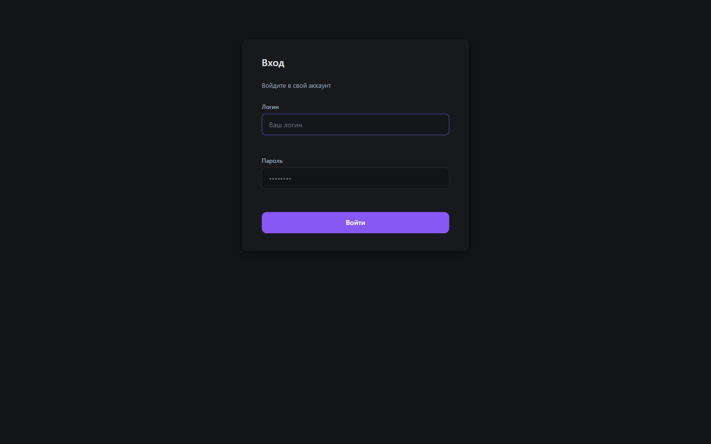
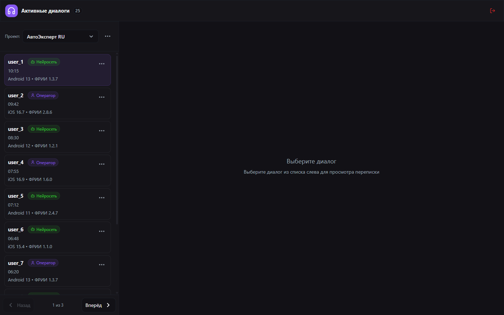
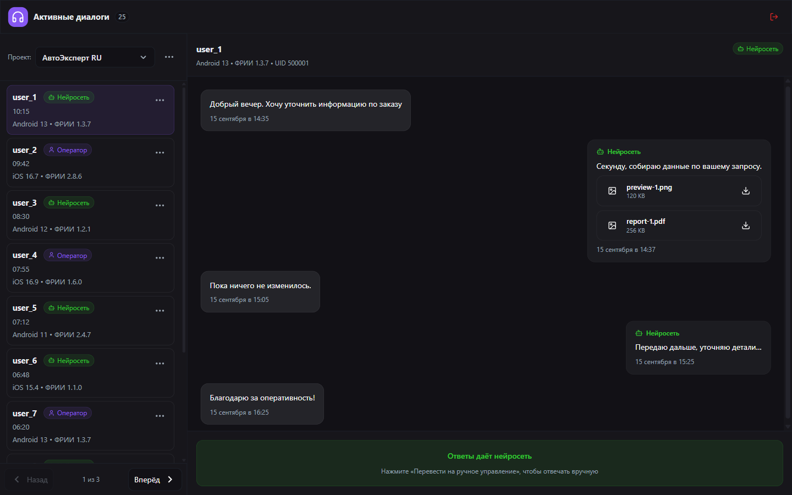
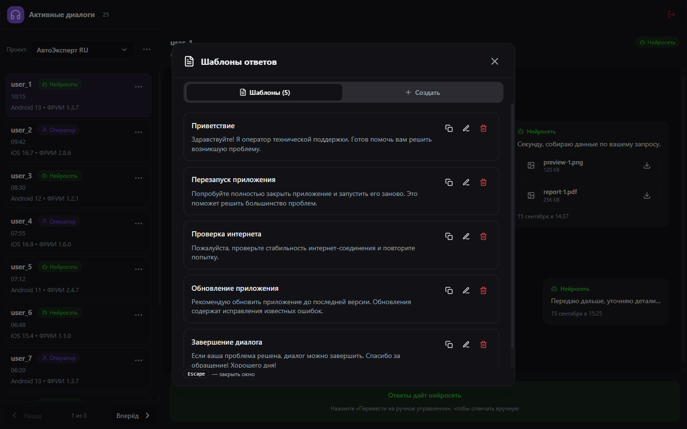

# Support Chat (Prototype)

A small frontend prototype of a support operator panel (active / archived dialogs, message list, reply templates, confirmation modals, toast notifications).

> The backend is currently emulated with mock data and local in-JS stores.

## Screenshots

| Login | Operator panel |
|-------|----------------|
|  |  |

| Chat with attachments | Reply templates |
|-----------------------|-----------------|
|  |  |

## Quick Start
1. Open `index.html` in any modern browser (Chrome, Firefox, Edge).
2. To emulate login, use any username (min. 3 characters, Latin letters/digits/`._-`) and password (min. 6 characters).
3. After login, the list of active dialogs is available. The archive is switched via the project menu (three dots → "Open archived chats").

## Architecture (brief)
- `scripts.js` — a monolithic file of modules (IIFE), no bundler.
- Modules: Auth, ActiveDialogsApp, LogoutConfirm, UnsubscribeModal, ServiceToasts.
- Dialog / message data is mock (arrays + in-memory MessageStore). The archive is seeded lazily.
- Reply templates — local in-memory store (CRUD).
- Messages support attachments (inline image / file) with upgrade / fallback rendering.

## Public API
All stable functions are aggregated in the `window.AppAPI` object (versioned). Existing globals (`Auth`, `showServiceNotification`, `app.dialogs`, etc.) are kept for backward compatibility, but the unified API is recommended.

Version `1.0.1` (patch): added attachment support (inline image / file) for client messages (`author: 'client'`). Previously client attachments were ignored during rendering.

```js
console.log(AppAPI.version)         // '1.0.0'
```

### Auth (`AppAPI.auth`)
| Method | Description |
|-------|----------|
| `isAuthed()` | Returns `true/false` — whether a (mock) token exists. |
| `getPhase()` | Current state machine phase: `unauthenticated | auth-loading | auth-failed | authenticated`. |
| `showLogin()` | Show the login screen. |
| `showApp()` | Force-show the application (used after a successful login). |
| `logout()` | Log out (clears the token and returns to the login screen). |

### Dialogs (`AppAPI.dialogs`)
| Method | Description |
|-------|----------|
| `select(id)` | Select a dialog and display its messages. |
| `getById(id)` | Get the dialog object (active or archived). |
| `toggleArchive()` | Toggle Active ↔ Archive mode (re-renders the list). |
| `switchToOperator(id, {source})` | Hand a dialog over from the bot to an operator (updates the badge and footer). |
| `timers.set(id, value, opts)` | Set a timer pill (text, `opts.datetime`, auto-show). |
| `timers.show(id)` | Show the timer. |
| `timers.hide(id)` | Hide the timer. |

### Messages (`AppAPI.messages`)
| Method | Description |
|-------|----------|
| `add(dialogId, { author, text, attachments, createdAt })` | Locally add a message (demo) to the given dialog. Returns the message object. `author: client|bot|operator|system`. In a real integration, replace with a server send followed by synchronization. |

#### Attachment format (attachments[])
```ts
{
  id: string | number,
  name: string,
  size?: '123 KB',
  contentType?: string,        // MIME
  url?: string,                // for inline preview
  downloadUrl?: string,        // download link
  displayHint?: 'inline-image' | 'file'
}
```
If `displayHint` is not specified, the system tries to classify it itself (image/* and size <= 800KB → inline image).

Example of adding a client message with attachments (since version 1.0.1):
```js
AppAPI.dialogs.select(3);
AppAPI.messages.add(3, {
  author: 'client',
  text: 'Here is a file and a screenshot',
  attachments: [
    {
      id: 'cimg1',
      name: 'screen.png',
      size: '120 KB',
      contentType: 'image/png',
      url: 'https://picsum.photos/seed/client123/320/180'
    },
    {
      id: 'cdoc1',
      name: 'spec.pdf',
      size: '250 KB',
      contentType: 'application/pdf',
      downloadUrl: 'https://example.com/spec.pdf'
    }
  ]
});
```

### Templates (`AppAPI.templates`)
| Method | Description |
|-------|----------|
| `open()` | Open the templates modal (CRUD via the UI). |

### Modals (`AppAPI.modals`)
| Method | Description |
|-------|----------|
| `logout()` | Open the logout confirmation modal. |
| `unsubscribe(dialogId)` | Open the "Unsubscribe" modal for the dialog's user. |

### Notifications (`AppAPI.notify`)
```
AppAPI.notify('Saved', 'Changes applied');
AppAPI.notify('Info without text');
```
Timeout options (legacy): `{ timeout: 6000 }`.

### Health Check
```
AppAPI.ping(); // { ok:true, ts: 173..., phase: 'authenticated' }
```

## Usage Examples
```js
// Select a dialog and add an operator message
AppAPI.dialogs.select(3);
AppAPI.messages.add(3, { author:'operator', text:'Good afternoon! How can I help?' });

// Hand over from bot to operator
AppAPI.dialogs.switchToOperator(3);

// Set an SLA timer
AppAPI.dialogs.timers.set(3, '15m', { datetime: new Date().toISOString() });

// Show templates
AppAPI.templates.open();

// Notification
AppAPI.notify('Done', 'Template saved');
```

## Browser Events
| Event | detail |
|-------|--------|
| `auth:change` | `{ phase, error }` — dispatched when the auth state changes. |

Example:
```js
window.addEventListener('auth:change', e => console.log('Auth phase:', e.detail.phase));
```

## Limitations / What Is Mocked
- No real network layer (login / messages / templates).
- Message ids are generated locally (`temp:*`).
- Handoff to an operator does not call the server — it is just a mutation of a local array.
- Image previews use the public `picsum.photos` (can be replaced with a CDN).

## How to Adapt to a Real Backend
1. Replace `loginRequest` with a fetch to the API (+ error handling).
2. Move `MOCK_DIALOGS` and `ARCHIVE_DIALOGS` to a paginated list endpoint.
3. Upgrade `MessageStore` to two-way synchronization (WebSocket / SSE / polling).
4. Move TemplatesStore to REST (CRUD endpoints) + optimistic UI.
5. Add delivery statuses (sent/delivered/read) based on server events.

## Licensing / Handover
Unless agreed otherwise, consider the code delivered **as-is** as part of a freelance task; further modularity work can be done separately.
